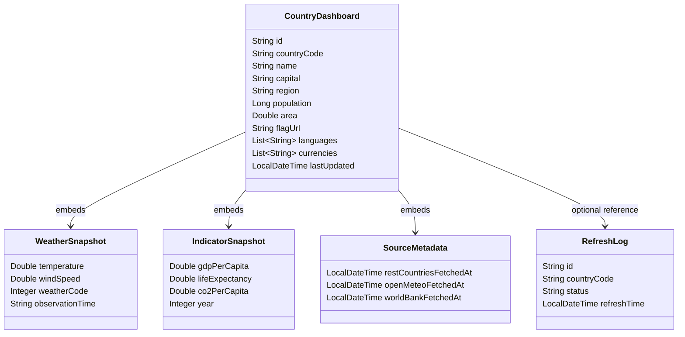

# Country Data Dashboard

## Opis projektu

**Country Data Dashboard** to projekt zaliczeniowy z przedmiotu **„Systemy akwizycji i przetwarzania danych”**. Celem projektu jest zbudowanie kompletnej aplikacji webowej, która:

- pobiera dane z **3 zewnętrznych API**,
- agreguje i przetwarza te dane po stronie backendu,
- zapisuje wyniki w bazie danych **MongoDB**,
- udostępnia własne API dla warstwy frontendowej,
- prezentuje dane w formie czytelnego dashboardu z elementami graficznymi.

Aplikacja umożliwia porównywanie wybranych państw pod względem danych ogólnych, pogody w stolicy oraz podstawowych wskaźników społeczno-ekonomicznych.

---

## Cel projektu

Projekt realizuje typowy scenariusz systemu akwizycji i przetwarzania danych:

1. **Akwizycja danych** z wielu zewnętrznych źródeł.
2. **Transformacja i normalizacja** pobranych danych do wspólnego modelu.
3. **Składowanie danych** w bazie noSQL.
4. **Udostępnienie danych** poprzez własne REST API.
5. **Wizualizacja danych** w aplikacji frontendowej.


---

## Zakres funkcjonalny

Planowana aplikacja będzie umożliwiać:

- pobranie danych dla wybranego kraju,
- zapis zagregowanych danych do bazy MongoDB,
- odczyt zapisanych danych przez backend,
- porównanie kilku krajów na dashboardzie,
- wyświetlenie podstawowych informacji o kraju,
- prezentację wskaźników na wykresach.

Minimalny zakres funkcjonalny obejmuje:

- listę krajów,
- szczegóły pojedynczego kraju,
- endpoint do odświeżenia danych,
- widok porównawczy dla 2–3 państw,
- prosty dashboard frontendowy.

---

## Wybrane zewnętrzne API

W projekcie zostaną użyte trzy niezależne zewnętrzne API:

### 1. REST Countries
Źródło podstawowych informacji o państwach.

Pobierane dane:
- nazwa kraju,
- kod kraju,
- stolica,
- region,
- populacja,
- powierzchnia,
- flaga,
- języki,
- waluty.

### 2. Open-Meteo
Źródło danych pogodowych dla stolic państw.

Pobierane dane:
- aktualna temperatura,
- prędkość wiatru,
- kod pogodowy,
- czas obserwacji.

### 3. World Bank Indicators API
Źródło danych statystycznych i ekonomicznych.

Planowane wskaźniki:
- GDP per capita,
- life expectancy,
- CO2 emissions per capita.

---

## Wybrane technologie

Projekt zostanie zrealizowany z użyciem następujących technologii:

### Backend
- **Kotlin** – główny język backendu
- **Spring Boot** – framework do budowy REST API
- **Spring Data MongoDB** – warstwa dostępu do danych
- **Gradle** – system budowania projektu

### Baza danych
- **MongoDB** – dokumentowa baza danych noSQL
- opcjonalnie **MongoDB Compass** – narzędzie do podglądu danych

### Frontend
- **React** – biblioteka do budowy interfejsu użytkownika
- **Vite** – szybkie środowisko uruchomieniowe i build frontendowy
### Narzędzia dodatkowe
- **GitHub** – repozytorium projektu
- **Docker / Docker Compose** – uruchamianie MongoDB lokalnie

---

## Przygotowane środowisko w GitHub

Projekt jest planowany jako repozytorium typu **monorepo** zawierające backend, frontend oraz dokumentację techniczną.

### Nazwa repozytorium

`country-data-dashboard`

https://github.com/RadzkiK/country-data-dashboard

### Proponowana struktura katalogów

```text
country-data-dashboard/
  backend/
  frontend/
  docs/
  README.md
  .gitignore
```

### Zakładana organizacja repozytorium

- `backend/` – aplikacja Spring Boot w Kotlinie,
- `frontend/` – aplikacja React + Vite,
- `docs/` – diagramy, screenshoty, dokumentacja projektu,
- `README.md` – opis projektu i instrukcja uruchomienia,


---

## Architektura rozwiązania

Projekt będzie miał klasyczną architekturę trójwarstwową:

1. **Frontend** – warstwa prezentacji danych.
2. **Backend** – warstwa logiki, integracji z API i agregacji danych.
3. **MongoDB** – warstwa przechowywania danych.

---

## Opis bazy danych

W projekcie zostanie zastosowana dokumentowa baza danych **MongoDB**.

Zamiast klasycznego modelu relacyjnego SQL zostanie użyty model dokumentowy, w którym głównym bytem jest zagregowany dokument reprezentujący jeden kraj wraz z osadzonymi danymi pogodowymi i ekonomicznymi.

### Główna kolekcja

- `country_dashboards`

### Przykładowy dokument

```json
{
  "id": "...",
  "countryCode": "PL",
  "name": "Poland",
  "capital": "Warsaw",
  "region": "Europe",
  "population": 38000000,
  "area": 312696,
  "flagUrl": "https://...",
  "languages": ["Polish"],
  "currencies": ["Polish zloty"],
  "weather": {
    "temperature": 12.4,
    "windSpeed": 18.1,
    "weatherCode": 3,
    "observationTime": "2026-03-18T10:00:00Z"
  },
  "indicators": {
    "gdpPerCapita": 22112.33,
    "lifeExpectancy": 78.5,
    "co2PerCapita": 7.9,
    "year": 2024
  },
  "sourceMetadata": {
    "restCountriesFetchedAt": "2026-03-18T10:15:00",
    "openMeteoFetchedAt": "2026-03-18T10:15:10",
    "worldBankFetchedAt": "2026-03-18T10:15:20"
  },
  "lastUpdated": "2026-03-18T10:15:20"
}
```


## Logiczny model danych

W sensie logicznym model można opisać następująco:

- `CountryDashboard` – główny dokument agregujący dane o kraju,
- `WeatherSnapshot` – osadzony subdokument z danymi pogodowymi,
- `IndicatorSnapshot` – osadzony subdokument ze wskaźnikami,
- opcjonalnie `RefreshLog` – osobna kolekcja logów odświeżania danych.

Relacje mają charakter **logiczny**, a nie relacyjny w sensie klasycznych baz SQL.

---

## Diagram modelu danych w Mermaid


